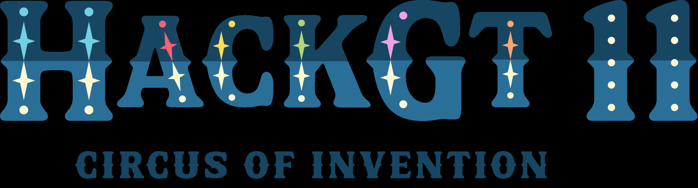

# Branch

##### Bryson Alexander Bien - brysonbien@gmail.com
##### Elliot Pal Willner - elliotwillner@gatech.edu
##### Aditya Singh - adityasht@gmail.com
##### Feiyang Xie - fxie64@gatech.edu

### Branch is an interactive iOS application meant to improve human relationships and develop habits associated with positive mental health.

An app that fosters real-life connections is valuable because it promotes deeper, more meaningful relationships, which are essential for mental and emotional well-being. Unlike digital interactions, face-to-face connections provide trust, empathy, and support, reducing stress and loneliness. Research shows that people with strong in-person networks are happier and healthier. By encouraging these real-life interactions, the app can help build stronger communities, enhance social cohesion, and support overall mental health, making it a powerful tool for positive social change.

The Harvard Study of Adult Development, one of the longest studies on human happiness, found that close **relationships**, more than money or fame, are what keep people happy throughout their lives. Encouraging people to connect face-to-face can foster a sense of community, reduce social isolation, and promote mental health, making Branch a powerful tool for positive social change.

Branch enables users to make plans with real people, in real life, therefore fostering these close relationships that will ultimately keep them happy throughout their lives.

Using numerous technologies, such as:

- [x] Generative AI
- [x] AWS Cloud Database
- [x] React Front End

Branch uses state-of-the-art methodology towards tackling a necessary challenge in today's world.

### Our Methodology

On Friday night, we discussed ideas and came to a conclusion on what we would be attempting during the hackathon. We also assigned roles:

- Feiyang: Front End
- Elliot: Database & AI
- Aditya: Back End
- Bryson: Back End

We were also able to develop our first test database, hosted locally in a MySQL server instance, and wrote the beginning of both the front end and back end code.

On Saturday, we met bright and early to continue work on our project. We were able to successfuly employ use of a cloud database, develop generative AI functionality within the app, establish API linkage with Instagram for follower/following scraping, fully develop front end design, and build out the server and APIs for the back end's interaction with the front end.

